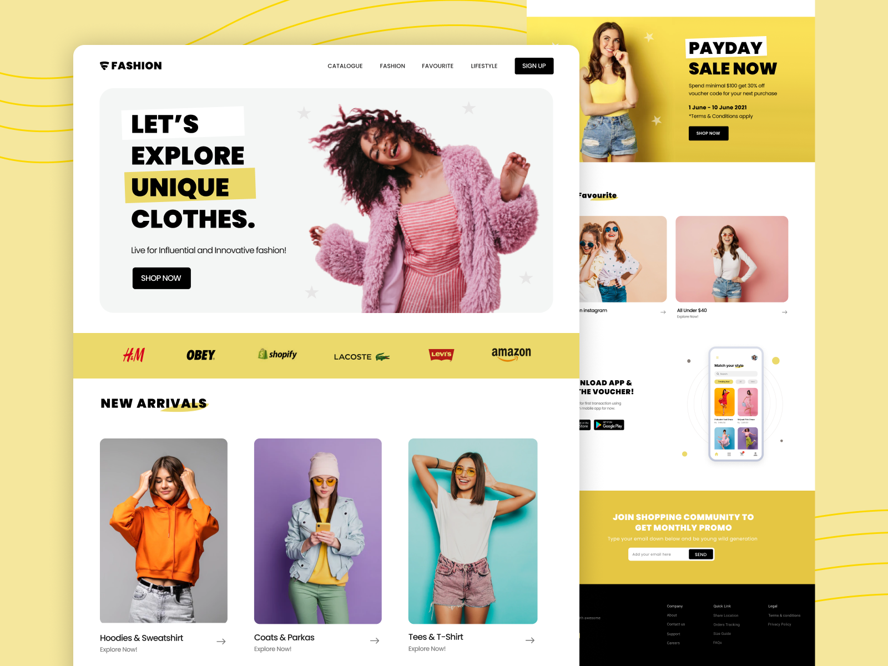

# Fashion - UI
Aplicação feita em Next.js, Tailwind e Framer Motion, simulando uma loja de compras online, este site foi feito com o intuito de aprender um pouco sobre o framer motion e tailwind.

## Documentação da Aplicação :weight_lifting:
Este repositório contém a implementação do site Fashion UI uma aplicação construída em:
- Next.js - 13.5.2
- Tailwind - 3.3.3
- Framer Motion - ^10.16.4

## Instalação e configuração :computer:
- Faça o clone deste repositório: `git clone`
- Certifique-se de ter o Node.js 18 e NPM 9.8.1 instalados em sua máquina.
- Execute `npm install` na pasta raiz do projeto para criar instalar as dependências.
- Por fim, execute `npm run dev` para subir a aplicação em modo de desenvolvimento.
# fashion-ui
